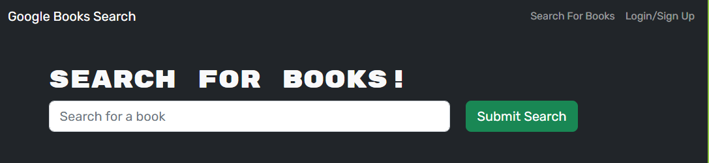

# Google Book Search App
Book search engine using Google book search API

## Description

The purpose of this project was to create a web application that allows a user to create a user account, search for books, and save books to and remove books from a favorites list, and view a list of all saved favorite books.

## Usage

A user creates a user account by clicking Login/Sign Up in upper right hand corner of the application, selected the sign up tab and entering the required user registration information.  Once logged in a user can search for a book by entering search criteria into the search bar.  Once a list of books is returned, each book will have a button that allows the user to save the book.  A user can view a listing of all saved book by clicking on the "See Your Books" link in the upper right hand corner of the page.  One the list of saved books is shown, each book will have a red button that  allows the user to delete a book from their saved books.

## Installation

The deployed application can be found at this URL https://guarded-cliffs-38287.herokuapp.com/.

## Credits

N/A

## License

Please refer to the LICENSE in the repo.